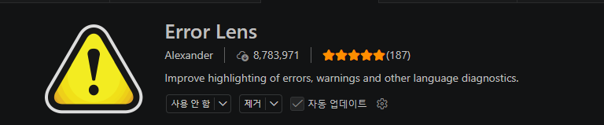
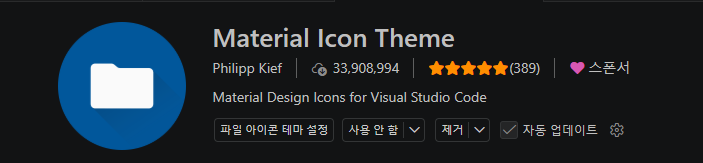
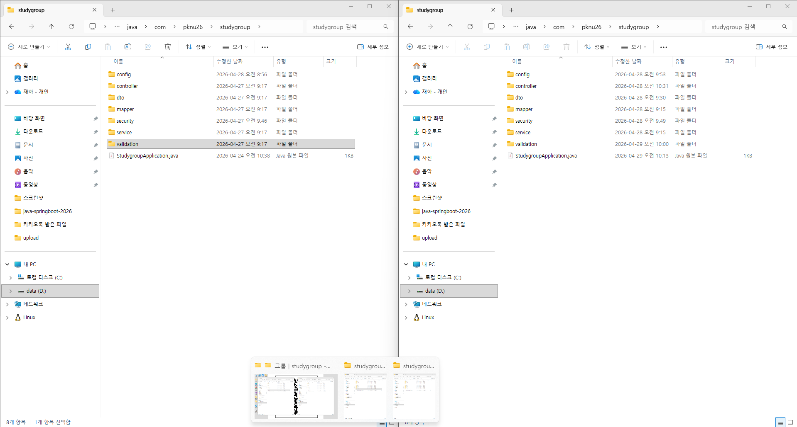
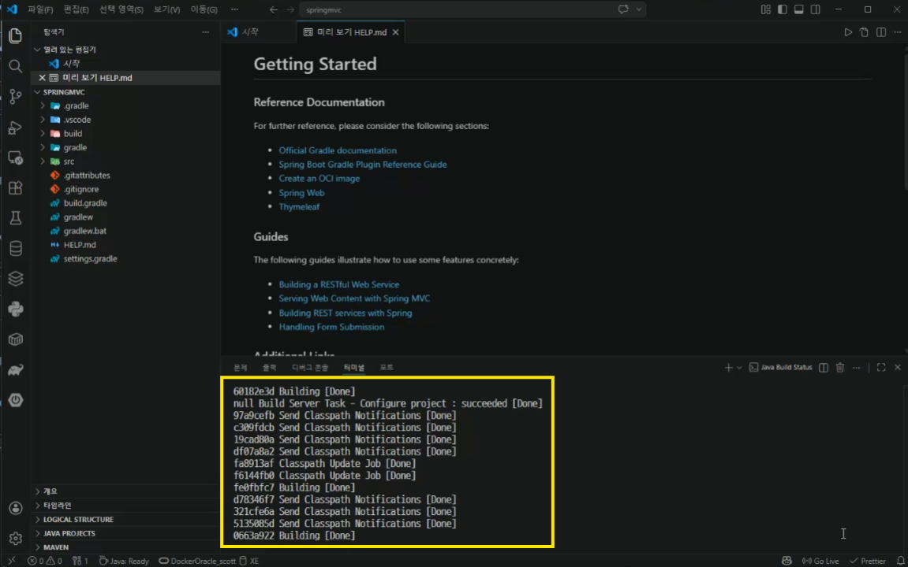
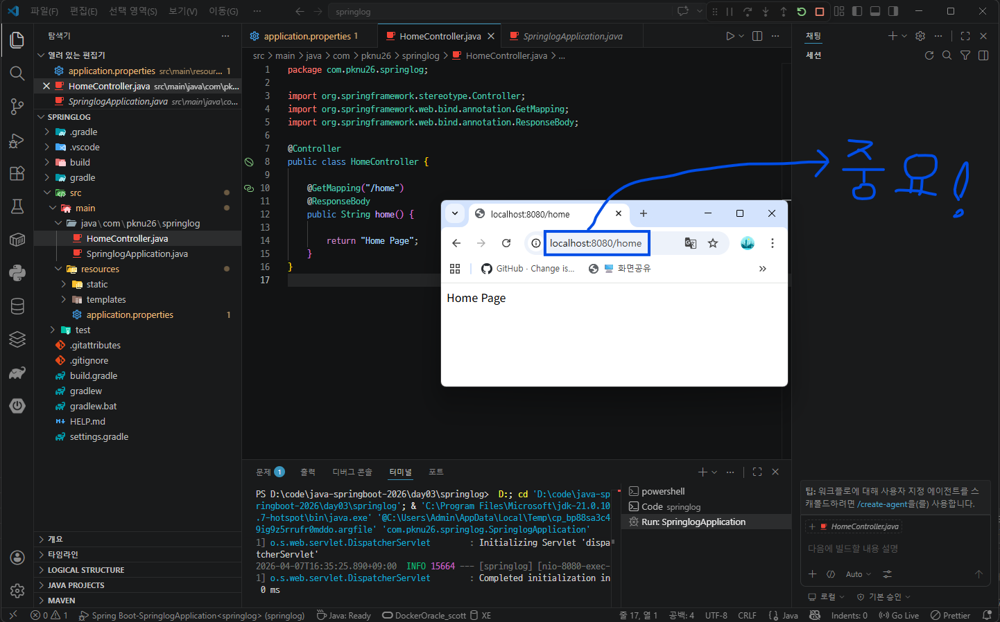
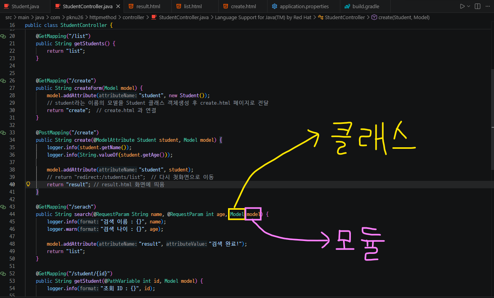
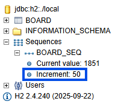
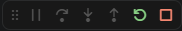
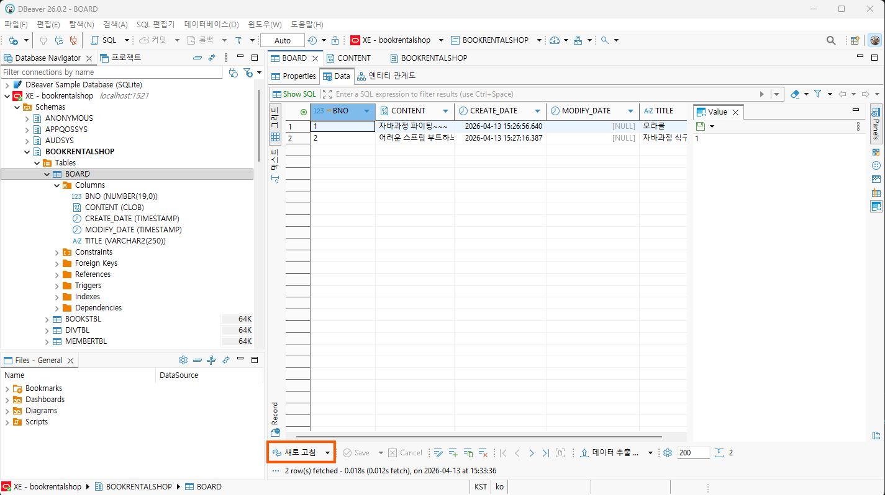

<Spring boot 로 코드 작업할 때 진짜 유용한 확장 프로그램 2가지>

1. Error Lens



2. Material Icon Theme



 🌟 웹사이트 작동하기 전에 DBeaver에서 sql 쿼리 추가하기. 만약 기존의 객체를 사용하고 있다면, 삭제하고 다시 새로고침하기!!

Spring boot에서 interface는 큰그릇이라고 생각하면 쉬움.

validation은 틀, 방지턱으로 생각하면 쉬움.

<Spring boot에서 디버그 실행 방법>
디버그 실행 클릭 -> 중단점 추가후 spring boot 실행하고 웹브라우저 열기(디버그 실행 전에 Spring Boot dash board 끄기)

⭐ Value는 lombok이 아님.

깃허브 웹 페이지 접속 주소:  https://github.dev/github/dev

<깃허브 main과 branch의 차이점>
main : 본사
branch : 지점

```java
`// OAuth2 의존성 틀린 예(Spring Boot)
implementation 'org.springframework.boot:spring-boot:spring-boot-starter-security-oauth2-client'`
```

```java
`// OAuth2 의존성 맞는 예(Spring Boot)
implementation 'org.springframework.boot:spring-boot-starter-security-oauth2-client'` 
```

🌟 강사님 말씀대로 JWT와 OAUTH는 거의 비슷함.

🌟 의존성 안된다고 해서 validation 파일 날리기 절대 금지!!

Spring boot 파일 복사 붙여놓기 하는 방법 👇 



⭐ 미니 프로젝트 할 때 팀부터 먼저 꾸리기!!

<팀 프로젝트 방법>

1. 팀부터 먼저 꾸리기
2. 프로젝트 주제 먼저 정하고 시작하기

<의존성 확인>
pypi - 파이썬 의존성검사
Maven repository - 자바 의존성검사

⭐ 회사에서 주석 다는 기호 : /** */

⭐ VScode 프로그램에서 파일이나 폴더를 클릭한 뒤 F2키를 누르면 이름이 바뀜

⭐ data는 java.util로 사용해야함!!

⭐ 강사님 말씀대로 Spring boot 보다 Web token 구현이 더 어려움.

⭐ java 백앤드 할 때 글자는 반드시 대문자로 하고, Control은 Control, Mapper는 Mapper 대로 통일한다!!

⭐ 빨간 줄이 뜰때 항상 가장 마지막에서 Ctrl + 마침표 혹은 Ctrl + Spacebar 키 누르기!!

⭐ 무조건 파일 저장된거 부터 확인하고 그것부터 안되면 다시 수정하기!!

⭐ 데이터 베이스은 지우되, 파일은 안지움

⭐ 디버그 안하면 오류 못잡음!!

⭐ 깃허브에 동영상 올리고 커밋한 후 VScode에서 동기화 안하면 서로 충돌함!!

⭐ 실제 개발할때는 요구사항 적고 시작함!!

⭐ role admin은 관리자, role user은 일반사용자, role guest는 손님임.

⭐ 인증과 권한은 다름

⭐ Spring과 react는 전혀 다름.

⭐ 강사님 말씀대로 웹 사이트는 내용만 다를 뿐 형식은 거의 똑같다!!!

⭐ 팀 단위로 미니 프로젝트 할 때 처음부터 복잡하게 하기 금지. 먼저 로그인, 회원가입 기능부터 추가하기!!

⭐ 처음부터 완벽한 프로는 없음!!

⭐ ***스프링부트에서 빨간 줄 오류난 거 있으면 항상 마지막 문자에서 컨트롤 + 스페이스 키 누른 후 탭(Tab) 하기!!***

***⭐ 강사님 말씀대로 VS code [README.md](http://README.md) 있는 창에서 Spring Boot 소스코드 작성하기 절대 절대 금지!!!***

***⭐ Spring Boot에서 코딩 작업할 때 오타가 있는지 없는지 코드검수 하기!!***

- Ctrl + X 키 : 잘라내기 키

- VScode에서 Ctrl + Shift + F키를 누르면 검색 가능함!!

- Ctrl + H 키 : 상속 계층찾기

- F10 번 키 : 출력 변수확인 하기

**src\main\java\com\pknu26\studygroup\resources\mapper에 있는 경로 파일에서 Application은 Application 이고, Post면 Post이다.**

templates\post\detail.html 댓글등록 버튼 코드에 있는 </i> 입력한 후 중복된 아이콘 닫기

아래 노란색 박스로 표시된 터미널 명령어는 별개이므로 안떠도 굳이 신경쓰지 않아도 됨👇



Done 나오는 것은 문제없이 끝났다는 얘기임.

컨트롤러가 있어야 실행해서 볼 수 있다.

Spring과 JAVA는 코끼리가 떠야 한다.

수료 후에 깃허브 잘 꾸며 놓으면 돈 받을 수 있음!!!

깃허브 리포지토리는 매우 중요한 자산임!!

네이버, 구글 주소검색창 안에 있는 https에서의 s는 Security라는 뜻임.

Spring Boot에서 HomeController 출력하는 방법 예시(결과 화면 출력은 구글 크롬에서 함)👇



🌟 Spring Boot에서 Ctrl + 마침표 키 누르면 제너레이트 소스코드가 나온다.

Ctrl + 마침표 키만 잘 사용하면 코딩이 엄청 편해짐!!

Gradle에 있는 dependencies는 깃허브로 치면 레포지토리랑 비슷하다고 생각하면 쉬움!!

서버 바뀌면 무조건 재시작 하기!!

메소드 때문에 겟메핑, 포스트메핑이 발생하는 일도 있음.

강사님 말씀대로 Get과 Post만 잘 사용하면 됨.

RequestParam은 구시대, PathVariable은 신세대 방식이지만 깃허브, 네이버 등에 많이 활용되므로 둘다 할 줄 알아야 함.

Spring Boot에서 빨간색으로 뜬 것은 오류 표시임. 

**강사님 말씀대로 한 줄 은 물론 여러 소스코드 열들을 드래그 한 후 Shift + Delete 키를 누르면 줄이 지워짐.**

아래 Spring Boot 클래스, 모듈 구조 👇



**제너레이트 컨스트럭터는 굳이 힘들게 코딩하지 말라는 의미임(Ctrl + 마침표키 누르면 나옴).**

Spring Boot에서 출력을 나타내기 위해서는 파일 경로, 철자 모두 맞아야 함.

회사에서 VScode로 작업할 때 파일에 새창을 오픈할 필요 없음.

Logger라고 해서 다 같은 로거가 아님(막 넣기 금지)!!

GET과 POST는 완전 다름!!

회사에 가면 Spring initializr: Specify java version 는 17버전, 21버전을 쓰는 경우도 있음.

강사님 말씀대로 개발자가 개발 툴을 설치 못하는 것은 안됨!!

개발툴은 VScode, 플러그인(VScode에 있는 확장프로그램)을 말하는 것임.

🌟 POST, GET 예시

POST 예시 : 네이버 창에 로그인 버튼 누르거나 검색창을 누르는 것

GET예시 : 네이버에서 아이디, 비번 입력한 후 로그인 버튼 누르는 것

스프링 부트에서 SEQUENCE는 자동으로 1씩 증가한다는 의미임.

**⭐ Spring Boot 에서 테스트 실행하는 방법(중요!!)**

**테스트 실행하기 → Apps 에 있는 보드실행 → 웹(구글 크롬) 확인**

Controller는 우리가 할테니까 너가 View만해(but 회사마다 다름).

List(java.util)

자바의 특징은 C#과는 다름

리스트는 무조건 For이다.

⭐ Spring Boot 작업순서

컨트롤러 - 보드 작업 - 리포지토리

findById가 옵션보드임.

Html 작업 중에 줄 못 맞추면 문서서식하기 

부트스트랩은 버튼이든 리본이든 예쁘게 만들면 장땡

Spring Boot 참고 홈페이지 자료 아래 링크 👇

https://www.thymeleaf.org/

https://getbootstrap.com/docs/5.3/components/buttons/

***⭐ Spring Boot에서 코드 다 작성하고 서버 재시작하기!!***



개발 할 때 Increment 50을 바꿀 필요 없다!!

프론트와 화면이 바뀌면 GET임. 

데이터 베이스에서 저장, 삭제는 POST이며, 그외에는 POST가 아니다.

SpringBoot에서 Ctrl + Shift + F5키를 누르면, 아래 실행버튼이 나옴 👇



@Controller라고 입력한 후 Ctrl + 스페이스 키 누른 후 엔터키 누르면 위에 import가 나옴.

웹보드에서 DBeaver에서 리스트들을 출력할려면, Data 탭 창에 있는 새로고침 버튼(주황색 박스로 표시 된거) 누르기



⭐ ***회사에서 일반 업무를 볼때 Session을 24시간으로 설정하되, 금융권에서는 Session을 15분으로 설정하기.***

## **SpringBoot에 있는 어노테이션**

Spring Boot에서 어노테이션(Annotation)은 코드에 붙이는 '라벨'이나 '설명표'라고 생각하면 쉬워요. 자바 컴파일러나 Spring 프레임워크에게 **"이 클래스는 컨트롤러야", "이 변수에는 객체를 자동으로 넣어줘"** 같은 지시를 내리는 역할을 함.

어노테이션 덕분에 복잡한 XML 설정 없이도 아주 간결하게 코딩할 수 있게 되었으며, 가장 자주 쓰이는 핵심 어노테이션들이 있음.

---

### 1. 가장 중요한 시작점

- **`@SpringBootApplication`**: Spring Boot 앱의 심장입니다. 이 어노테이션 하나가 다음 세 가지 기능을 합쳐놓은 것임.
    - `@Configuration`: 설정을 위한 클래스임을 명시.
    - `@EnableAutoConfiguration`: 미리 정의된 설정을 자동으로 적용.
    - `@ComponentScan`: 특정 패키지 안의 클래스들을 찾아 Spring 빈(Bean)으로 등록.

---

### 2. 역할별 라벨 (Stereotype Annotations)

Spring이 관리해야 할 객체(Bean)들을 역할에 따라 구분함.

| **어노테이션** | **설명** |
| --- | --- |
| **`@Controller`** | 웹 브라우저의 요청을 받아 HTML 뷰를 반환할 때 사용함. |
| **`@RestController`** | 데이터(JSON/XML) 자체를 반환할 때 사용함 (최신 API 개발에 주로 쓰임). |
| **`@Service`** | 비즈니스 로직(실제 핵심 기능)을 처리하는 클래스에 붙임. |
| **`@Repository`** | 데이터베이스(DB)와 통신하는 데이터 접근 계층에 붙임. |
| **`@Component`** | 위 역할 구분이 모호할 때, 단순히 Spring이 관리해달라고 지정할 때 사용함. |

---

### 3. 요청과 응답 (Web Mapping)

클라이언트가 보낸 주소(URL)를 어떤 메서드가 처리할지 결정함.

- **`@RequestMapping`**: 공통 주소를 묶을 때 사용합니다 (예: `/api/user`).
- **`@GetMapping`**: 데이터를 조회할 때 (SELECT).
- **`@PostMapping`**: 데이터를 새로 생성할 때 (INSERT).
- **`@PutMapping`**: 데이터를 수정할 때 (UPDATE).
- **`@DeleteMapping`**: 데이터를 삭제할 때 (DELETE).

---

### 4. 의존성 주입 (Dependency Injection)

- **`@Autowired`**: Spring이 관리하는 객체를 필요한 곳에 **자동으로 연결**해 줍니다. "이 객체 내가 쓸 거니까 알아서 가져다줘!"라는 뜻임.

---

### 5. 데이터 전달 받기

- **`@PathVariable`**: URL 경로에 포함된 값을 변수로 받을 때 (예: `/user/{id}`).
- **`@RequestParam`**: 쿼리 파라미터 값을 받을 때 (예: `?name=kim`).
- **`@RequestBody`**: 클라이언트가 보낸 JSON 데이터를 자바 객체로 변환해서 받을 때 사용함.

---

**한 줄 요약:**

어노테이션은 Spring Boot에게 "이 클래스가 무슨 일을 하는지"를 알려줘서, 우리가 일일이 객체를 생성하고 연결하는 수고를 덜어주는 아주 똑똑한 도구임.

**※ Spring Boot 에서 오류난 거 있을 때 수정하고, 테스트 다시 재실행하기**

**※ Spring Boot 할 때 Test 건드리기 금지!!**

♦️***Maven에서 Gradle로 전환하는 명령어 : gradle init***

***<난이도>***

***Maven : 어려움***

***gradle : 쉬움***

프론트 React 와 백앤드 서버 포트(예 : 5173)는 통일하되, 만약 따로 있으면 같이 켜기!!

프론트 React는 새로고침만 하면 됨.

만약 Ollama와 같이 연동되어 있다면, Ollama도 반드시 켜기!!

# ☆ PC 크롬에서 휴대폰 포트 포워딩을 추가해도 모바일에서는 계속 검은화면이 뜨는 현상일때 대처법 👇

## 1단계: 포트 포워딩 활성화 상태 '신호등' 확인 (가장 흔한 실수)

chrome://inspect 창에서 포트 포워딩을 추가한 것만으로는 연결이 작동하지 않습니다. 기기 이름 옆에 **초록색 불**이 들어왔는지 확인해야 합니다.

1. PC 크롬의 chrome://inspect 화면으로 이동합니다.
2. Remote Target 목록에 있는 내 휴대폰 이름 옆을 확인합니다.
3. 포트 번호(5173) 옆에 **초록색 원(●)**이 켜져 있어야 정상 연결된 것입니다.
    - **주황색/빨간색이거나 불이 없다면:** USB 케이블 연결이 불안정하거나 휴대폰에서 'USB 디버깅 허용' 팝업을 승인하지 않은 것입니다. 케이블을 뽑았다가 다시 끼우고 휴대폰 화면에서 허용을 눌러주세요.
4. **[중요]** Enable port forwarding 체크박스에 **체크**가 누락되었는지 반드시 확인하세요.

## 2단계: 백엔드 포트(8080)도 함께 포워딩하기

프론트엔드 포트(5173)만 포워딩하면 화면 틀은 받아오지만, 로그인 정보나 초기 데이터를 가져오는 백엔드(localhost:8080) 요청을 휴대폰이 내부적으로 처리하지 못해 검은 화면에서 멈춥니다.

PC 크롬의 **[Port forwarding...]** 설정을 열고 아래와 같이 **두 개 다** 등록되어 있는지 확인하세요.

| Port | IP address and port | 역할 |
| --- | --- | --- |
| 5173 | localhost:5173 | React 프론트엔드 연결 화면 구성 |
| 8080 | localhost:8080 | Spring Boot 백엔드 및 Ollama AI 통신 |

**💡 이렇게 설정하면:** 앞서 수정했던 axios 설정의 baseURL을 다시 원래대로 "http://localhost:8080/api/v1"로 놔두어도 휴대폰이 알아서 PC의 백엔드를 찾아갑니다.

## 3단계: 크롬 포트 포워딩이 계속 안 될 때 - 사설 SSL(HTTPS) 우회법

만약 크롬 포트 포워딩 기능 자체가 말썽을 부린다면, 포트 포워딩을 과감히 포기하고 **원래 사용하던 컴퓨터 IP 주소 접속(http://210.119.14.58:5173) 환경에서 카메라 보안 제한만 강제로 푸는 방법**이 있습니다.

모바일 크롬 브라우저에는 특정 HTTP 주소를 HTTPS처럼 안전하다고 착각하게 만드는 비밀 메뉴가 있습니다.

1. **휴대폰 크롬 앱**을 켭니다.
2. 주소창에 다음 주소를 입력하고 이동합니다.

  ``` text 
   chrome://flags
  ```

3. 맨 위 검색창에 **unsafely**라고 검색합니다.
4. **Insecure origins treated as secure** 항목을 찾습니다.
5. 아래쪽 입력창에 내 컴퓨터 IP와 프론트 포트를 입력합니다.

   ```text
   http://210.119.14.58:5173
   ```

6. 오른쪽의 우측 드롭다운 메뉴를 Disabled에서 **Enabled**로 변경합니다.
7. 크롬 화면 오른쪽 아래에 뜨는 **[Relaunch]** (다시 시작) 버튼을 누릅니다.
8. 이제 휴대폰 주소창에 http://210.119.14.58:5173을 입력하고 접속하면 카메라 권한 허용 팝업이 뜨면서 검은 화면이 해결됩니다!

🌟 postman 프로그램도 다운 받아서 실행하면 좋음(POST, GET 확인용)

VScode 환경에서 아이콘 뜨게하는 방법 👇

