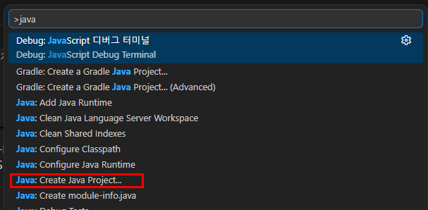
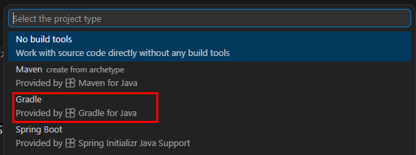
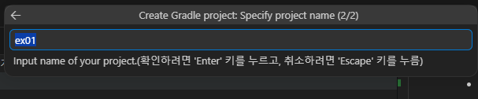
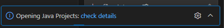
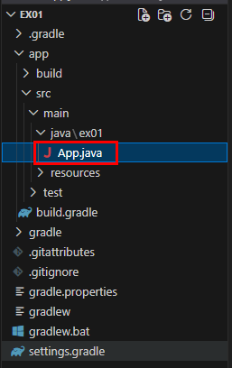
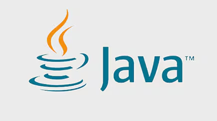
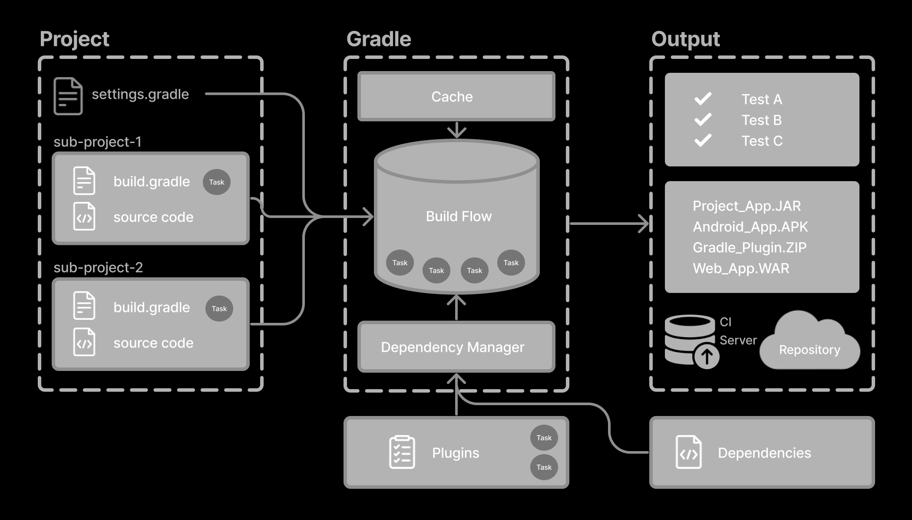

# java-springboot-2026

2026년 java개발자과정 SpringBoot 리포지토리

## 1일차

### 개발환경 설정

### Java 설정

- 터미널/파워쉘에서 자바 설치여부 확인

```powershell
> java --version
openjdk 21.0.10 2026-01-20 LTS
OpenJDK Runtime Environment Microsoft-13106404 (build 21.0.10+7-LTS)
OpenJDK 64-Bit Server VM Microsoft-13106404 (build 21.0.10+7-LTS, mixed mode, sharing)
```

- Java 설치되어 있으면 위와 같이 출력
- 아닌 경우는 아래 중에서 선별해서 설치
  - Oracle JDK - https://www.oracle.com/kr/java/technologies/downloads/
  - `OpenJDK` - https://jdk.java.net/archive/
  - Adoptium JDK - https://adoptium.net/
  - Azul JDK - https://www.azul.com/downloads/

#### VS code 설정

- 개발툴에 JDK 설정 다양
  - Eclipse, Intelij, NetBeans, `Visual Studio Code` 중 선정

- VS Code 확장
  - Java 검색

  
  - 설치. Debugger 포함 6개 확장이 추가 설치됨

#### Java 개발환경 확인

1. 명령 팔레트(Ctrl + Shift + P) 오픈

   

2. `java: Create Java Project...` 선택

   

3. 폴더 선택

4. DSL 선택

   

5. Gradle 프로젝트명 선택

   

6. 오른쪽 하단에 프로젝트 진행 팝업

   

7. 완료 메시지 팝업 - 오픈

   

8. 새 VS Code 오픈 -> 빌드 진행

   

9. Gradle 확장이 있는지 확인

   

10. app/src/main/java/ex01/App.java 파일 확인

    

11. Ctrl + F5 실행

    

### Java 프로젝트

#### Java 학습 이유

- Python, Javascript도 웹 서비스를 구현 가능. 개발도 빨리 가능
- Python 웹 개발 - 빨리 만들자
- Javascript 웹 개발 - 자유롭게 만들자
- Java 웹 개발 - 안전하게 오래쓰는 웹을 만들자. 실수가 나지 않도록 서비스

#### Java



- 1995년에 제임스 고슬링 개발자 발표
- 객체지향 언어 - Python, JavaScript, C++, C#, Go...
- 가전제품에 탑재하기 위해서 개발 -> 웹 개발, 모바일(안드로이드) 이후 실제 가전제품 탑재 중
- 대한민국에서 웹에 가장 많이 사용되는 언어, 기업 80% 이상에서 사용 중

- 사용가능한 곳
  - `웹 개발`(JSP, Spring, SpringBoot)
  - 순수 안드로이드 개발
  - 이외 모든 분야 개발가능
  - 시스템 프로그래밍, 높은 성능 요구, iOS 모바일 개발 은 어려움

#### Java 실행 구조

- 컴파일(빌드) -> 실행
  - .java(소스코드) -> `.class` -> JVM 실행

- 타언어 C/C++/C# 컴파일 후 -> .exe 파일 생성, 실행

- 중요 용어
  - JDK : Java Development Kit. 자바 개발하려면 필수로 설치해야하는 키드
  - JRE : Java Runtime Enviornment. JDK보다 작은 그룹. 자바 실행할 수 있는 파일만 존재
  - JVM : Java Virtual Machine. 자바로 컴파일된 바이트코드를 실행시키는 가상머신. JRE/JDK 포함
    - OS 플랫폼 독립적으로 동작. 윈도우에 개발한 자바도 리눅스 등에서 실행 가능

#### 프로젝트 그룹

- 번호가 작을 수록 큰 그룹

1. VS Code 개발툴 : 개발을 위한 모든 것이 포함
2. Java : 개발하기 위한 언어
3. JDK : 개발 툴킷
4. JVM : 자바가 실행 될 수 있는 환경
5. Gradle : JVM 상에서 동작하는 Java 빌드 도구. Java 프로젝트 환경자체를 거의 자동으로 구성
6. Java 폴더, 소스 : Gradle이 설정한 필요 폴더와 위치에 파일들 배치

#### 빌드도구

- 프로젝트 빌드, 자바 의존성(라이브러리) 관리, 문서화, 프로젝트 전체 관리
  - Maven : 오래된 빌드도구. xml 기반. pom.xml
  - `Granle` : Maven 단점을 잡아낸 빌드도구. 텍스트 문서기반. build.gradle 로 관리

  

#### 프로젝트 구조

```text
ex01/
 ├─ app/
 │   ├─ src/
 │   │   ├─ main/
 │   │   │   └─ java/
 │   │   └─ test/
 │   │       └─ java/
 │   └─ build.gradle 또는 build.gradle.kts
 ├─ settings.gradle 또는 settings.gradle.kts
 ├─ gradlew
 ├─ gradlew.bat
 └─ gradle/wrapper/
```

- `build.gradle` : Gradle 빌드 설정 파일. Java, SpringBoot 필요 라이브러리, 설정에 가장 중요한 파일
  - 플러그인 종료 선정
  - 의존성 추가
  - Java 버전 설정
  - 테스트 설정
  - 실행 설정

- setting.gradle : 프로젝트 명, 멀티 프로젝트 구성 정의. 구성요소 정의

- `src/main/java` : Java에서 개발할 실제 소스 위치 폴더

- src/text/java : 테스트 코드 위치 폴더. Java는 코딩과 테스트 동시에 진행

- gradlew, gradlew.bat : Gradle Wrapper 실행하는 파일

- DSL : Domain Specific Language. 특정 분야에 최적화된 프로그래밍 언어.
  - Groovy : build.gradle 파일 생성. 간결하게 사용가능. 작성방법 간단
  - Kotlin : build.gradle.kts로 파일 생성. 생산성, 코드 안정성 강점

- Kotlin : Java를 대체하는 언어. Java 기반. Kotlin은 안드로이드/iOS 동시 개발 가능

- 설정파일로 Kotlin 사용하는 것은 Groovy랑 별차이가 없어 보임

#### Java 기본 문법

#### 학습 방향

- Python, Javascript 학습완료 상태
  - [x] 변수, 데이터형
  - [x] 배열/리스트
  - [x] 연산자
  - [x] 제어문 : 조건문, 반복문
  - [ ] 객체지향
  - [ ] 메서드
  - [ ] 예외처리
  - [ ] 참조개념
  - [ ] 파일 입출력
  - [ ] 의존성

- 새로 공부한다 보다는 필요한 것만 보충해서 학습하겠다 생각

- JavaScript는 자바를 따라서 만들었다? Java와 JavaScript 문법은 많이 다름

#### 코드 구조

- 전체 코드

```java
package ex02_syntax;   /* 패키지 선언 */

public class App {    // 클래스 선언
    // 진입점(Entry point) - 프로그램이 시작되는 메서드
    public static void main(String[] args) {
        System.out.println("Hello, Java!");
    }
}
```

- TIP : Gradle for Java로 프로젝트 생성 후 src/test/java/.../AppTest.java 지우고 진행

#### 변수/데이터형

- 변수 - [소스](./day01/ex02_syntax/app/src/main/java/ex02_syntax/App.java)
  - 변하는 데이터를 담을 수 있는 상자와 같은 개념
  - 변수명은 의미있는 단어의 조합 : personalAccount, mylist...
  - Python, JS 변수명 지정방법과 동일

- 데이터 타입 : Java에서 변수에 어떤 데이터를 넣을지 지정
  - 기본 : int, long, float, double, char, String, boolean, ...
  - String은 클래스 타입이지만 기본적인 타입임
  - 데이터를 넣을때의 실수를 줄이기 위한 방법
  - Python과 달리 배열과 리스트가 따로 존재

- 클래스 타입 : java.\*\*\*\*. 형태로 클래스로 만들어진 타입 - 기본 자료형들을 클래스화 시킨 자료형도 존재. Integer, Float, Double, ...
  - 기본 자료형들을 클래스화 시킨 자료형도 존재. Integer, Float, Double, ...
  - List, StringBuffer, Map, Set, ...

- final
  - 한번 지정된 값을 변결 불가하게 만드는 키워드

#### 연산자

- 할당연산자 : =, +=, -=, \*=, /=, %=
- 산술연산자 : +, -, \*, /, %
- 증감연산자 : ++, --
- 비교연산자 : ==, !=, >, >=, <, <=
- 논리연산자 : &&, ||, !
- 비트연산자 : &, |, ^
- 삼항연산자 : (a > 5) ? "크다" : "작다" .if ~ else 를 inline 만든 연산자
- 문자열 연산자 : "Hello " + "World"
- 연산자 우선순위 : () > ++/-- > \* / % > + - > 비교연산 > 동등비교
  - 연산자 우선순위를 가장 위로 하려면 () 사용
- instanceof 연산자 : 객체 타입 확인 연산

#### 제어문

- if, switch-case, for, while

## 2일차 

### Java 기본 문법

#### 객체지향

#### 메서드

#### 예외처리
