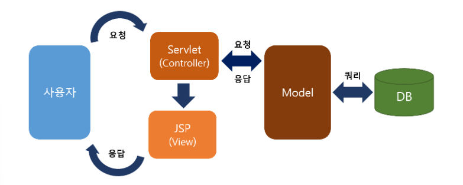
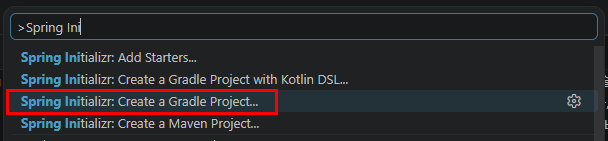
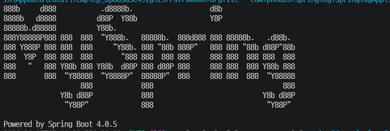

# java-springboot-2026

- 스프링부트 학습내용

## 3일차

### 웹 개요

- 구성 3단계
  - 웹브라우저(프론트엔드) - 사용자의 `요청`하고 결과를 돌려받는 화면. HTML/CSS/JS
  - 웹서버(백엔드) - 사용자 요청을 받아서 DB에 데이터 읽고, 프론트엔드에 보낼 데이터를 전송(`응답`)
  - 데이터베이스 - 데이터를 저장, 읽는 부분

- 웹 개념 : 사용자의 요청(`Request`)에 대한 서버의 응답(`Response`)

### Spring Boot

- Java를 기반으로 웹 서버를 만들 수 있는 백엔드 프레임워크 중 하나

- 웹 기술 히스토리
  - CGI : 내용 생략
  - Servlet : CGI를 개선한 웹 기술. HTML을 Java소스 내 전부 작성(개발 난이도 상)
  - EJB(Enterprise Java Bean) : Servlet으로 대형 기업 프로젝트 개발(개발 난이도 극상)
  - `JSP`(Java Server Page) : HTML과 Java소스를 분리. 쉽게 개발하도록 만든 기술(난이도 중)
    - 개발환경 구성 난이도가 높음
  - `Spring` : Java개발 전성기. 웹페이지와 Java영역 분리. 개발환경 구성 난이도 줄어듬
    - 개발환경 구성 난이도 중
    - 대한민국 전자정부 웹프레임워크 개발
  - `Spring Boot` : Spring 개발환경 구성 단점, 개발 단점 최소화

#### Spring Boot

- https://spring.io/ 공식 웹사이트
- Spring 의 기술 그대로 사용 (마이그레이션 간단)
- JPA 기술 사용, ERD나 DB설계 하지않고 손쉽게 DB생성, 연동 쉬움
- 개발 시 웹 서버를 따로 구축할 필요 없음. (운영 시에는 설치 필요)
- 단위 테스트용 의존성, 로그 의존성 포함
- 개발을 도와주는 서포트 기능 다수 존재
- 프론트엔드 지원 다양. JSP, Thymeleaf, Mustache 등
- React.js 등 자바스크립트 기반 프론트엔드와 연계 -> 풀스택
- MVC(Model-View-Control) 모델. 각 파트별로 따로 개발 가능



#### Spring Boot 개발환경 설정

##### Java

- Java JDK : 17버전 이상
- 시스템 정보(sysdm.cpl)에서 JAVA_HOME 등록
- Path 연계

##### 개발툴

- Visual Studio Code 확장
  - Spring Boot Extension Pack 설치
  - Spring Initializr Java Support 설치 확인
  - Lombok Annotations Support for VS Code 설치

##### 데이터베이스

- Database : Oracle 21, H2(Spring Boot 제공)

#### Spring Boot 프로젝트 생성

1. 명령 팔레트(Ctrl + Shift + P) 에서 `Spring` 검색

   

2. Spring Initializr: Specify Spring Boot version
   - SNAPSHOT : 개발 중 버전. 매우 불안정
   - M2, M3, M4 : 주요기능 완성 단계. 안정버전 아님
   - RC :, 출시 직전
   - 4.0.5 : 정식버전

3. Specify project language
   - `Java`
   - Kotlin
   - Groovy

4. Input Group Id
   - 그룹 아이디
   - com.example : mail.naver.com / news.naver.com 등 naver.com을 거꾸러 사용하는 것
   - mail, news : 프로젝트 ID
   - `com.pknu26` 로 통일

5. Input Artifact Id
   - 프로젝트 아이디 demo

6. Input Package Name
   - 프로젝트아이디.그룹아이디

7. Specify packaging type
   - Spring 실행파일을 어떤 타입(`Jar`, war)으로 압출할지 지정
   - `Jar` : Java Archive
   - War : Web Archive

8. Specify Java version
   - `21` 선택
   - 설치된 JDK 자바버전과 동일

9. Choose dependencies - [소스](./day03/demo/build.gradle)
   - 필요한 의존성(라이브러리) 선택
   - 최초 Spring Web만 선택

10. Generate into this folder 창에서 폴더 선택

11. 새 창 열기

12. Gradle, Java 빌드 진행 - [소스](./day03/demo/src/main/java/com/pknu2026/demo/DemoApplication.java)
    - 빌드 이후 작업표시줄 Java : Ready가 표시되야 함
    - Java: Error는 프로젝트 생성 실패. 새로 구성

    

#### Spring Boot 프로젝트 실행

1. Spring Boot Dashboard

   

2. 컴파일 진행

3. 로그 출력

   
   - Started DemoApplication... port 8080 확인

4. 웹브라우저 http://localhost:8080

   

5. application.properties 오픈 - [소스](./day03/demo/src/main/resources/application.properties)
   `spring.output.ansi.enabled=always` 작성

#### Spring Boot 필요 설정 확인

- build.gradle : 자바버전, 플러그인, 의존성 설정 파일 - [소스](./day03/demo/build.gradle)

```groovy
// Gradle 플러그인 설정
plugins {
	id 'java'   // Java 프로젝트 기본 플러그인
	id 'org.springframework.boot' version '4.0.5'   // Spring Boot 플러그인
	id 'io.spring.dependency-management' version '1.1.7'   // 의존성 버전 자동관리 플러그인
}

group = 'com.pknu2026'  // 그룹 ID. URL도메인 반대로 작성
version = '0.0.1-SNAPSHOT'  // 프로젝트 버전. 실제 배포시는 1.0.0 으로 변경

java {
	toolchain {
		languageVersion = JavaLanguageVersion.of(21)  // 사용 중인 Java JDK 버전
	}
}

repositories {  // 의존성 저장소 설정
	mavenCentral()
}

// 라이브러리 의존성 설정. 대부분 여기를 설정
dependencies {
	implementation 'org.springframework.boot:spring-boot-starter-webmvc'    // Spring MVC
	testImplementation 'org.springframework.boot:spring-boot-starter-webmvc-test'   // 테스트용
	testRuntimeOnly 'org.junit.platform:junit-platform-launcher'   // 단위 테스트 실행기
}

// 테스트 작업 설정
tasks.named('test') {
	useJUnitPlatform()  // JUnit5 사용
}
```

- dependencies 외에는 거의 손댈일 없음

- DemoApplication.java - [소스](./day03/demo/src/main/java/com/pknu2026/demo/DemoApplication.java)
  - @SpringBootApplication : 스프링부트 설정 클래스임 지칭. 컴포넌트 스캔 수행. 자동설정 어노테이션
  - SpringApplication.run(...) : 스프링 컨테이너 실행, 내장 서버(톰캣) 띄움

- Spring Boot 실행 명령어

  ```bash
  > .\gradlew.bat bootrun
  ```

#### Spring MVC

- Spring Boot 프로젝트 초기화 동일
  - 의존성에서 Spring Web, Thymeleaf 선택

- Spring MVC 구조

  ```text
  src
  ┣ main
  ┃ ┣ java
  ┃ ┃ ┗ com/pknu26/springmvc
  ┃ ┃    ┣ SpringmvcApplication.java    // 전체 애플리케이션(서버실행)
  ┃ ┃    ┣ controller   // Controller 영역
  ┃ ┃    ┃  ┗ HomeController.java
  ┃ ┃    ┗ service  // Model을 동작시키는 영역
  ┃ ┃       ┗ MessageService.java
  ┃ ┗ resources
  ┃    ┣ templates  // View 영역
  ┃    ┃  ┣ home.html
  ┃    ┃  ┗ hello.html
  ┃    ┗ application.properties
  ```

  - 브라우저 요청 -> Controller 호출 -> Model을 데이터 담고(Service) -> View 반환 -> 요청한 브라우저에 돌려줌

- Spring MVC 구현
  1. Service/MessageService.java 생성 - [소스](./day03/springmvc/src/main/java/com/pknu26/springmvc/Service/MessageService.java)
  2. Controller/HomeController.java 생성 - [소스](./day03/springmvc/src/main/java/com/pknu26/springmvc/Controller/HomeController.java)
  - 필요한 그룹에 따라 여러개 컨트롤러를 만들 수 있음
  3. View, src/main/resources/templates/home.html 생성 - [소스](./day03/springmvc/src/main/resources/templates/home.html)
  4. 기본 순서는 Controller, Service와 View 순
  5. 소스코드 작성, 수정 이후 서버 재시작 필수!

- 어노테이션 목록
  - @SpringBootApplication : 손대지 말것
  - @Controller : 컨트롤러 영역
  - @Service : 모델처리를 위한 서비스 영역
  - @GetMapping, @PostMaping : 웹 매핑 종류 결정...
  - @ResposeBody : 응답페이지에 텍스트 출력 어노테이션

- Model, View, Controller 영역
  - 구분지어서 따로 개발
  - 팀 프로젝트 가능. 역할분담

#### Spring Log

- 로그 출력 작업
  - application.properties 에 로그 설정 - [소스](./day03/springlog/src/main/resources/application.properties)

```
## 스프링부트 내장 로그모듈 사용
logging.level.root = info
# 로그 저장 파일 지정
longging.file.name = /testlog.log
```

- 로그 사용법 - [소스](./day03/springlog/src/main/java/com/pknu26/springlog/HomeController.java)
  - Controller, Service, Respository 클래스에서 사용가능

#### Spring Log 배너

- 중요도 없음

- resources 폴더에 banner.txt 생성 - [소스](./day03/springlog/src/main/resources/banner.txt)
- [Spring Boot Banner Generator](https://devops.datenkollektiv.de/banner.txt/index.html)


